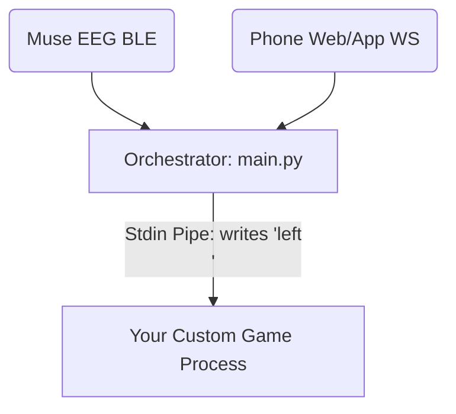

# 🕹️ BCI Game Integration Guide

Welcome to the BCI Game Integration Guide! This document explains how to connect **any custom game or application** (whether built in Python, Unity, C++, Godot, or Node.js) to the master orchestrator (`main.py`) to control it using brainwaves (Muse EEG), phone gestures (IMU), or speech commands.

---

## 📡 The Integration Architecture

The orchestrator (`main.py`) handles all low-level hardware connections (BLE to Muse, WebSockets to mobile phones), threshold calculations, and input mapping configurations. 

When you launch an external game from the dashboard, `main.py` spawns it as a child process using a **standard input (stdin) pipe**. When a mapped command triggers, the orchestrator writes the command string directly to the game's stdin stream.



---

## ⚡ The 7 Standard Command Signals

Your game should listen on `sys.stdin` (standard input) for the following command strings (each terminated by a newline `\n`):

| Command String | Default Keyboard Mapping | Suggested Game Action |
| :--- | :--- | :--- |
| `left` | Left Arrow / `A` | Steer left, rotate counter-clockwise, or go back. |
| `right` | Right Arrow / `B` | Steer right, rotate clockwise, or go forward. |
| `up` | Up Arrow / `W` | Steer upwards, accelerate, or jump. |
| `down` | Down Arrow / `S` | Steer downwards, decelerate, or duck. |
| `action` | Spacebar | Primary action: start, pause, or fire main weapon. |
| `sec_action` | Left Mouse Click / Shift | Secondary action: fire spread shot, drop bomb, shield. |
| `tert_action` | Right Mouse Click / Ctrl | Tertiary action: smart bomb, ultimate ability, cycle skins. |

---

## 🛠️ Step-by-Step Integration (Python / Pygame Template)

To read standard input without blocking your game's rendering loop (which usually runs at 60 FPS), you must read stdin on an **asynchronous background thread**. 

Here is a complete, minimal, and fully-commented boilerplate template you can copy and paste to get started:

```python
import sys
import threading
import pygame

# 1. Thread-safe command queue
pending_command = None
lock = threading.Lock()

def stdin_reader_thread():
    """Reads commands piped from main.py's stdin in a background thread."""
    global pending_command
    print("📡 BCI Reader: Active and listening for stdin commands...")
    for line in sys.stdin:
        cmd = line.strip().lower()
        if cmd:
            with lock:
                pending_command = cmd
                print(f"📥 Received BCI Command: '{cmd}'")

# Start the background thread
thread = threading.Thread(target=stdin_reader_thread, daemon=True)
thread.start()

# 2. Main Pygame initialization
pygame.init()
screen = pygame.display.set_mode((600, 400), pygame.RESIZABLE)
pygame.display.set_caption("My BCI Integrated Game")
clock = pygame.time.Clock()

# Game variables
circle_x = 300
circle_y = 200
circle_color = (56, 189, 248) # Cyan

running = True
while running:
    clock.tick(60) # Run at 60 FPS
    
    # Check Pygame window events (quit, resize, keyboard fallbacks)
    for event in pygame.event.get():
        if event.type == pygame.QUIT:
            running = False
        elif event.type == pygame.VIDEORESIZE:
            screen = pygame.display.set_mode((event.w, event.h), pygame.RESIZABLE)
            
    # 3. Poll for BCI / stdin commands
    cmd = None
    with lock:
        if pending_command:
            cmd = pending_command
            pending_command = None # Clear after reading
            
    # 4. Handle commands
    if cmd:
        if cmd == "left":
            circle_x -= 30
        elif cmd == "right":
            circle_x += 30
        elif cmd == "up":
            circle_y -= 30
        elif cmd == "down":
            circle_y += 30
        elif cmd == "action":
            circle_color = (16, 185, 129) # Change color to green
        elif cmd == "sec_action":
            circle_color = (239, 68, 68)  # Change color to red
        elif cmd == "tert_action":
            circle_color = (252, 211, 77)  # Change color to yellow
            
    # Draw screen
    screen.fill((15, 23, 42)) # Dark background
    pygame.draw.circle(screen, circle_color, (circle_x, circle_y), 25)
    pygame.display.flip()

pygame.quit()
```

---

## 🎮 Integrating in Other Languages

### 1. Unity (C#)
In Unity, you can capture stdin by reading from standard input on a separate thread or coroutine:
```csharp
using System;
using System.Threading;
using UnityEngine;

public class BCIInputListener : MonoBehaviour
{
    private string lastCommand = "";
    private Thread readThread;

    void Start() {
        readThread = new Thread(ReadStdin);
        readThread.IsBackground = true;
        readThread.Start();
    }

    void ReadStdin() {
        while (true) {
            string cmd = Console.ReadLine();
            if (!string.IsNullOrEmpty(cmd)) {
                lastCommand = cmd.Trim().ToLower();
            }
        }
    }

    void Update() {
        if (lastCommand != "") {
            Debug.Log("Executing BCI Command: " + lastCommand);
            // Translate lastCommand (left, right, up, down, action) to game actions here
            lastCommand = ""; // Clear
        }
    }
}
```

### 2. Node.js / Electron
```javascript
process.stdin.setEncoding('utf8');

process.stdin.on('data', (data) => {
    const cmd = data.trim().toLowerCase();
    console.log(`Received command: ${cmd}`);
    
    if (cmd === 'left') {
        // Trigger left steering
    } else if (cmd === 'right') {
        // Trigger right steering
    }
});
```

---

## 🚀 Adding Your Game to the Dashboard

Once you have written your script (e.g., `my_custom_game.py`), register it in [main.py](file:///home/john/git/muse-workshop/main.py)'s external launcher panel:

1. Open `main.py` and locate `init_control_tab(self)`.
2. Add a new button under the **External BCI Games Dashboard** frame:
   ```python
   my_game_btn = QPushButton("🎮 Start My Custom Game")
   my_game_btn.setStyleSheet("background-color: #1e1b4b; color: #a5b4fc;")
   my_game_btn.clicked.connect(lambda: self.launch_external("my_custom_game.py"))
   ext_layout.addWidget(my_game_btn)
   ```
3. Save and run `uv run main.py`. Your new game is now ready to receive multi-modal threshold signals!
